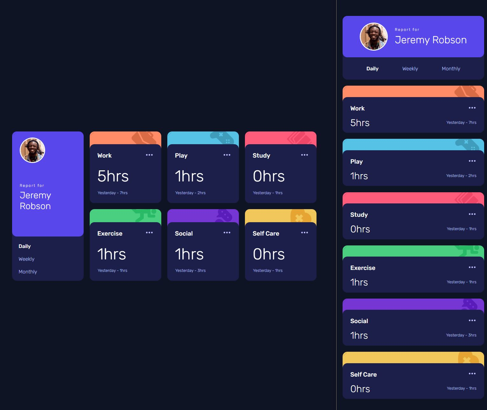

# Frontend Mentor - Time tracking dashboard solution

This is a solution to the [Time tracking dashboard challenge on Frontend Mentor](https://www.frontendmentor.io/challenges/time-tracking-dashboard-UIQ7167Jw). Frontend Mentor challenges help you improve your coding skills by building realistic projects.

## Table of contents

- [Overview](#overview)
  - [The challenge](#the-challenge)
  - [Screenshot](#screenshot)
- [My process](#my-process)
  - [Built with](#built-with)
  - [What I learned](#what-i-learned)
  - [Continued development](#continued-development)
  - [Useful resources](#useful-resources)

**Note: Delete this note and update the table of contents based on what sections you keep.**

## Overview

Application to control the time spent on various activities. This project has helped me develop a little more my design skills and expanded my knowledge of DOM

### The challenge

Users should be able to:

- View the optimal layout for the site depending on their device's screen size
- See hover states for all interactive elements on the page
- Switch between viewing Daily, Weekly, and Monthly stats

### Screenshot



## My process

In the first place, I began by presenting the project on paper and in pen, visualizing the requirements that it needed. Once this was clear, I began to program the HTML accompanied by the CSS, to add final functionality with vanilla JS.

### Built with

- Semantic HTML5 markup
- CSS
- Flexbox
- CSS Grid
- Mobile-first workflow
- Vanilla JavaScript

### What I learned

I have faced some small challenges that have helped me expand my learning, fluency and comfort barrier when it comes to programming both in the use of BEM in HTML, such as the precise and correct use of CSS, up to an optimal, clear but efficient use of vanilla JavaScript.

Like the combination of both classes via JavaScript to achieve a nice fade out effect when switching between timeframes.

```css
.timeCard__info {
  background-color: var(--mainColor);
  height: 76%;
  width: 100%;
  position: absolute;
  bottom: 0;
  padding: 1.5rem;

  display: grid;
  grid-template-columns: 1fr 1fr;
  transition: ease-in-out 0.1s;
}

.fade {
  opacity: 1;
  transition: opacity 300ms cubic-bezier(0.55, 0.085, 0.68, 0.53);
}
```

```js
async function printHours(event, sentence) {
  const data = await getData();
  selectedTime(event);

  for (let i = 0; i < data.length; i++) {
    const { current, previous } = data[i].timeframes[event];

    currentTime[i].classList.remove("fade");
    recordedTime[i].classList.remove("fade");

    setTimeout(() => {
      currentTime[i].innerHTML = `${current}hrs`;
      recordedTime[i].innerHTML = `${sentence} - ${previous}hrs`;

      currentTime[i].classList.add("fade");
      recordedTime[i].classList.add("fade");
    }, 225);
  }
}
```
